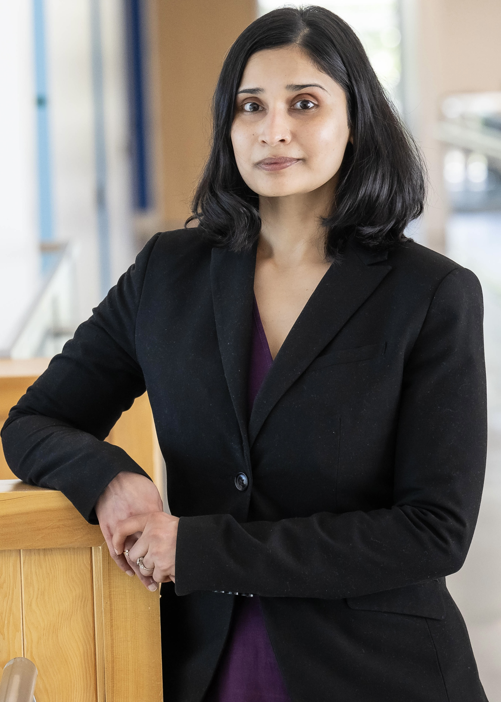

::: {.hero}
:::: {.columns .hero-grid}

::: {.column width="35%"}
{.profile-photo}
:::

::: {.column width="65%"}
### Associate Professor of Teaching  Computer Science

I am Varada Kolhatkar (\[ʋəɾəda kɔːlɦəʈkər\]), an educator in computer science specializing in applied machine learning and data science. My overarching goal is to make these fields more accessible, less intimidating, and still intellectually rigorous.

::: {.quick-links}
[Teaching](teaching.html){.btn .btn-primary}
[Projects](projects.html){.btn .btn-outline-primary}
[Contact](contact.html){.btn .btn-outline-secondary}
:::
:::
::::
:::

::: {.section-band}
## Recent Highlights

::: {.highlight-list}

2026

- [Awarded the Killam Teaching Prize](https://www.cs.ubc.ca/news/2026/04/varada-kolhatkar-awarded-killam-teaching-prize), recognizing excellence in teaching and contributions to student learning. April 2026
- Presented model AI assignment on [Dimensionality Reduction Adventures with Animal Faces](https://docs.google.com/presentation/d/1pZ0IUt9se_e0pfrF305YzFAYjHT1bwUuvodRPNkRWQs/edit?usp=sharing) at [the Educational Advances in Artificial Intelligence Symposium](https://eaai-conf.github.io/year/eaai-26.html). January 2026
- Supervised a directed study (CPSC 448) for two excellent undergraduate students, Irmak Bayir and Selin Uz who have built and deployed an advisor support tool using retrieval-augmented generation (RAG) on CS website data.

2025

- Co-designed and delivered a [full-day hands-on machine learning workshop](https://kvarada.github.io/FoS-Intro-to-ML-2025/) for Science faculty and postdocs at UBC. June 2025

2024

- [Featured by UBC Today](https://ubctoday.ubc.ca/stories/october-15-2024/blending-science-and-meditation-help-students-learn-calm-mind) for blending science and meditation to help students learn with a calm mind. September 2024

:::
:::

## About

My background is in computer science and I received my Ph.D. in computational linguistics from the [Department of Computer Science at the University of Toronto](https://www.cs.toronto.edu/compling/).
My heart is in teaching and learning and in the 2018-19 academic year, I was fortunate to have the opportunity to teach for [the Master of Data Science program](https://ubc-mds.github.io/about/) at [the University of British Columbia](https://www.ubc.ca/). Since then, I have been teaching courses in applied machine learning, artificial intelligence, and natural language processing in the Department of Computer Science and the Master of Data Science program. My current roles are Associate Professor of Teaching and Co-Director of the Master of Data Science Vancouver program. In simple terms, I strive to help students learn computer science and data science, while also working to ensure the smooth operation of our Master of Data Science program.

In the past, I have spent time as a researcher in industry as well as in academia in different cities around the world, including Duluth, Baltimore, Toronto, Ottawa, Stuttgart, and Hamburg.

If you are curious, Varada (वरदा) is a Sanskrit name, which means the one who grants your wishes! I grew up in a traditional household in a city called [Pune](https://en.wikipedia.org/wiki/Pune) in India. My first language is [Marathi](https://en.wikipedia.org/wiki/Marathi_language).
